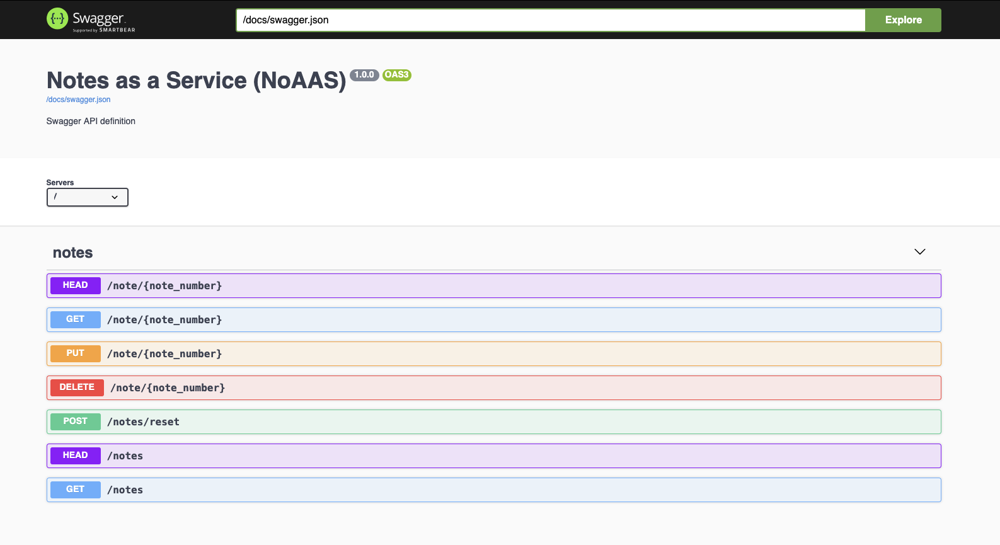
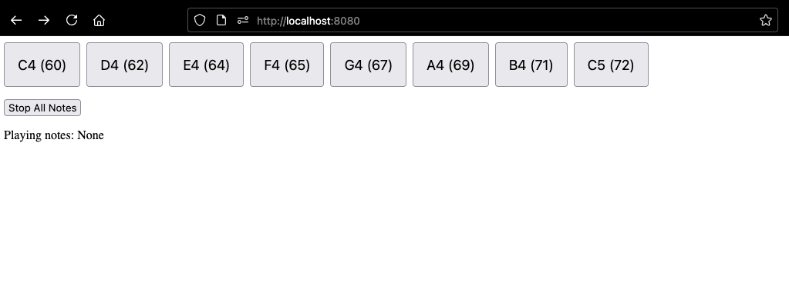

# Notes-as-web-service (NoAAS)

Fun little sunday project to create a little web service for playing notes over a restAPI

```sh
# quickstart:
just setup
just run
# take a look at the justfile to see what is going on
```






